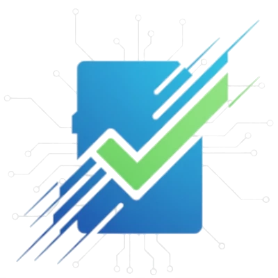
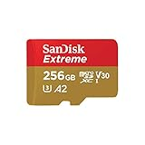
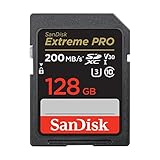
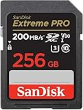

<!DOCTYPE html>
<!-- saved from url=(0058)https://sdcardchecker.com/guides/video-bitrate-comparison/ -->
<html lang="en"><head><meta http-equiv="Content-Type" content="text/html; charset=UTF-8">
			
			
  
  <meta name="viewport" content="width=device-width, initial-scale=1.0">
  <title>Video Codec &amp; Bitrate Guide: H.264 vs H.265 vs ProRes | SD Card Checker</title>
  <meta name="description" content="Compare H.264, H.265 (HEVC), &amp; ProRes codecs. See how bitrate impacts file size and quality for 4K video. Choose the right codec for your camera &amp; workflow.">
  <link rel="canonical" href="https://sdcardchecker.com/guides/video-bitrate-comparison/%7B%7BBASE_URL%7D%7D/guides/video-bitrate-comparison/">
  
  <!-- Open Graph for Social Sharing -->
  <meta property="og:type" content="article">
  <meta property="og:title" content="Video Codec &amp; Bitrate Guide: H.264 vs H.265 vs ProRes">
  <meta property="og:description" content="Choose the right codec to maximize video quality and minimize storage needs. Our guide makes it simple.">
  <meta property="og:image" content="{{BASE_URL}}/img/guides/video-bitrate-hero.webp">
  <meta property="og:url" content="{{BASE_URL}}/guides/video-bitrate-comparison/">
  <meta property="og:site_name" content="SD Card Checker">

  <!-- Twitter Card -->
  <meta name="twitter:card" content="summary_large_image">
  <meta name="twitter:title" content="Video Codec &amp; Bitrate Guide: H.264 vs H.265 vs ProRes">
  <meta name="twitter:description" content="H.264 vs H.265 vs ProRes - which video codec is right for you? Compare file sizes, quality, and storage needs.">
  <meta name="twitter:image" content="{{BASE_URL}}/img/guides/video-bitrate-hero.webp">

  <!-- Schema.org Markup -->
  

  <!-- Breadcrumb Schema -->
  
  
  <!-- FAQ Schema -->
  

  <link rel="stylesheet" href="./UI-UX-ISSUES_files/tailwind.css">
  <link rel="stylesheet" href="./UI-UX-ISSUES_files/modern.css">
  <link href="./UI-UX-ISSUES_files/all.min.css" rel="stylesheet">
  <!-- Hotjar -->

<!-- Grow Script -->

<link rel="modulepreload" as="script" crossorigin="" href="https://faves.grow.me/index-B9CZLg3l.js"><link rel="modulepreload" as="script" crossorigin="" href="./UI-UX-ISSUES_files/app.9.29.14.js.download"><link rel="modulepreload" as="script" crossorigin="" href="https://faves.grow.me/index-bc5L2pat.js"><link rel="modulepreload" as="script" crossorigin="" href="https://faves.grow.me/Close-CNgJkb_C.js"><link rel="modulepreload" as="script" crossorigin="" href="https://faves.grow.me/useViewedRecentlyPageIds-piz0dRAo.js"><link rel="modulepreload" as="script" crossorigin="" href="https://faves.grow.me/LockedPrintButtonModal-b-UkdoFU.js"><link rel="modulepreload" as="script" crossorigin="" href="https://faves.grow.me/index-CECI3_4d.js"><link rel="modulepreload" as="script" crossorigin="" href="https://faves.grow.me/index-CuMkBuoZ.js"><link href="./UI-UX-ISSUES_files/css" rel="stylesheet" type="text/css"><link rel="modulepreload" as="script" crossorigin="" href="https://faves.grow.me/CmpNotConsentedModal-C3BwJC0K.js"></head>
<body class="bg-gradient-to-br from-slate-50 to-slate-100 grow-me-scroll-carousel-active" bis_register="W3sibWFzdGVyIjp0cnVlLCJleHRlbnNpb25JZCI6ImVwcGlvY2VtaG1ubGJoanBsY2drb2ZjaWllZ29tY29uIiwiYWRibG9ja2VyU3RhdHVzIjp7IkRJU1BMQVkiOiJlbmFibGVkIiwiRkFDRUJPT0siOiJlbmFibGVkIiwiVFdJVFRFUiI6ImVuYWJsZWQiLCJSRURESVQiOiJlbmFibGVkIiwiUElOVEVSRVNUIjoiZW5hYmxlZCIsIklOU1RBR1JBTSI6ImVuYWJsZWQiLCJUSUtUT0siOiJkaXNhYmxlZCIsIkxJTktFRElOIjoiZW5hYmxlZCIsIkNPTkZJRyI6ImRpc2FibGVkIn0sInZlcnNpb24iOiIyLjAuMzMiLCJzY29yZSI6MjAwMzMwfV0=" __processed_cdcae16b-2b7c-421d-871c-653713394221__="true">
  <!-- Favicon -->
<link rel="icon" type="image/x-icon" href="https://sdcardchecker.com/img/favicon.ico">

<!-- Header -->
<header class="sticky top-0 z-50 bg-white shadow-sm header-nav-container">

<a href="https://sdcardchecker.com/" class="flex items-center gap-3 group flex-shrink-0">

SD Card Checker
</a>
    <nav class="header-nav hidden md:flex gap-8 items-center">
    <a href="https://sdcardchecker.com/" class="text-slate-600 hover:text-blue-600 font-medium transition-colors text-sm">Home</a>
    
    

    <a href="https://sdcardchecker.com/guides/video-bitrate-comparison/#" class="text-slate-600 hover:text-blue-600 font-medium transition-colors flex items-center gap-1 text-sm">
      Devices
      <i class="fas fa-chevron-down text-xs"></i>
      </a>
      

      

       <a href="https://sdcardchecker.com/categories/action-cameras/" class="block px-4 py-3 text-slate-700 hover:text-blue-600 hover:bg-blue-50 first:rounded-t-lg text-sm font-medium">Action Cameras</a>
       <a href="https://sdcardchecker.com/categories/cameras/" class="block px-4 py-3 text-slate-700 hover:text-blue-600 hover:bg-blue-50 text-sm font-medium">Cameras</a>
       <a href="https://sdcardchecker.com/categories/computing-and-tablets/" class="block px-4 py-3 text-slate-700 hover:text-blue-600 hover:bg-blue-50 text-sm font-medium">Computing &amp; Tablets</a>
       <a href="https://sdcardchecker.com/categories/drones/" class="block px-4 py-3 text-slate-700 hover:text-blue-600 hover:bg-blue-50 text-sm font-medium">Drones</a>
       <a href="https://sdcardchecker.com/categories/gaming-handhelds/" class="block px-4 py-3 text-slate-700 hover:text-blue-600 hover:bg-blue-50 text-sm font-medium">Gaming Handhelds</a>
       <a href="https://sdcardchecker.com/categories/security-cameras/" class="block px-4 py-3 text-slate-700 hover:text-blue-600 hover:bg-blue-50 last:rounded-b-lg text-sm font-medium">Security Cameras</a>
        

       

      

      

      <a href="https://sdcardchecker.com/guides/video-bitrate-comparison/#" class="text-slate-600 hover:text-blue-600 font-medium transition-colors flex items-center gap-1 text-sm">
      Calculators
      <i class="fas fa-chevron-down text-xs"></i>
      </a>
      

      

       <a href="https://sdcardchecker.com/tools/calculators/video-storage/" class="block px-4 py-3 text-slate-700 hover:text-blue-600 hover:bg-blue-50 first:rounded-t-lg text-sm font-medium">Video Storage &amp; Recording Time</a>
       <a href="https://sdcardchecker.com/tools/calculators/photo-storage/" class="block px-4 py-3 text-slate-700 hover:text-blue-600 hover:bg-blue-50 text-sm font-medium">Photo Storage &amp; Capacity</a>
       <a href="https://sdcardchecker.com/tools/calculators/drone-storage/" class="block px-4 py-3 text-slate-700 hover:text-blue-600 hover:bg-blue-50 text-sm font-medium">Drone Recording Time &amp; Storage</a>
       <a href="https://sdcardchecker.com/tools/calculators/security-camera-storage/" class="block px-4 py-3 text-slate-700 hover:text-blue-600 hover:bg-blue-50 text-sm font-medium">Security Camera Recording Time</a>
       <a href="https://sdcardchecker.com/tools/calculators/dashcam-storage/" class="block px-4 py-3 text-slate-700 hover:text-blue-600 hover:bg-blue-50 text-sm font-medium">Dashcam Storage &amp; Loop Time</a>
       <a href="https://sdcardchecker.com/tools/calculators/action-camera-storage/" class="block px-4 py-3 text-slate-700 hover:text-blue-600 hover:bg-blue-50 text-sm font-medium">Action Camera Storage &amp; Capacity</a>
       <a href="https://sdcardchecker.com/tools/calculators/gopro-storage/" class="block px-4 py-3 text-slate-700 hover:text-blue-600 hover:bg-blue-50 text-sm font-medium">GoPro Recording Time &amp; Storage</a>
       <a href="https://sdcardchecker.com/tools/calculators/timelapse-storage/" class="block px-4 py-3 text-slate-700 hover:text-blue-600 hover:bg-blue-50 last:rounded-b-lg text-sm font-medium">Timelapse Storage &amp; Photo Count</a>
       

       

      

      

      <a href="https://sdcardchecker.com/guides/" class="text-slate-600 hover:text-blue-600 font-medium transition-colors flex items-center gap-1 text-sm">
      Guides
      <i class="fas fa-chevron-down text-xs"></i>
      </a>
      

      

       <a href="https://sdcardchecker.com/guides/sd-card-guide/" class="block px-4 py-3 text-slate-700 hover:text-blue-600 hover:bg-blue-50 first:rounded-t-lg text-sm font-medium">SD Card Guide</a>
       <a href="https://sdcardchecker.com/guides/sd-card-speed-classes/" class="block px-4 py-3 text-slate-700 hover:text-blue-600 hover:bg-blue-50 text-sm font-medium">Speed Classes</a>
       <a href="https://sdcardchecker.com/guides/video-bitrate-comparison/" class="block px-4 py-3 text-slate-700 hover:text-blue-600 hover:bg-blue-50 text-sm font-medium">Video Bitrate Guide</a>
       <a href="https://sdcardchecker.com/guides/raw-vs-jpeg/" class="block px-4 py-3 text-slate-700 hover:text-blue-600 hover:bg-blue-50 text-sm font-medium">RAW vs JPEG</a>
       <a href="https://sdcardchecker.com/guides/is-my-sd-card-fake/" class="block px-4 py-3 text-slate-700 hover:text-blue-600 hover:bg-blue-50 last:rounded-b-lg text-sm font-medium">Fake SD Card Checker</a>
       

       

      

      <a href="https://sdcardchecker.com/about.html" class="text-slate-600 hover:text-blue-600 font-medium transition-colors text-sm">About</a>
    </nav>
    
    <!-- Mobile Menu Button -->
    <button class="md:hidden text-slate-600 hover:text-blue-600 mobile-menu-toggle flex items-center justify-center" aria-label="Toggle menu" id="mobileMenuBtn" style="width: 44px; height: 44px; padding: 0;">
      <i class="fas fa-bars text-xl" style="display: block;"></i>
    </button>
  

  
  <!-- Mobile Navigation Menu -->
  <nav class="mobile-menu hidden md:hidden bg-slate-50 border-t border-slate-200 max-h-[calc(100vh-80px)] overflow-y-auto" id="mobileMenu">
    

      <!-- Direct Links -->
      <a href="https://sdcardchecker.com/" class="block px-3 py-2 text-slate-700 hover:text-blue-600 hover:bg-blue-50 rounded-lg transition-colors text-sm font-medium">Home</a>
      
      <!-- Devices Section -->
      <button class="mobile-section-toggle w-full flex items-center justify-between px-3 py-2 text-slate-700 hover:text-blue-600 hover:bg-blue-50 rounded-lg transition-colors text-sm font-medium" data-section="devices">
        Devices
        <i class="fas fa-chevron-right transition-transform duration-300"></i>
      </button>
      

        <a href="https://sdcardchecker.com/categories/action-cameras/" class="block px-3 py-2 text-slate-700 hover:text-blue-600 hover:bg-blue-50 rounded-lg transition-colors text-sm">Action Cameras</a>
        <a href="https://sdcardchecker.com/categories/cameras/" class="block px-3 py-2 text-slate-700 hover:text-blue-600 hover:bg-blue-50 rounded-lg transition-colors text-sm">Cameras</a>
        <a href="https://sdcardchecker.com/categories/computing-and-tablets/" class="block px-3 py-2 text-slate-700 hover:text-blue-600 hover:bg-blue-50 rounded-lg transition-colors text-sm">Computing &amp; Tablets</a>
        <a href="https://sdcardchecker.com/categories/drones/" class="block px-3 py-2 text-slate-700 hover:text-blue-600 hover:bg-blue-50 rounded-lg transition-colors text-sm">Drones</a>
        <a href="https://sdcardchecker.com/categories/gaming-handhelds/" class="block px-3 py-2 text-slate-700 hover:text-blue-600 hover:bg-blue-50 rounded-lg transition-colors text-sm">Gaming Handhelds</a>
        <a href="https://sdcardchecker.com/categories/security-cameras/" class="block px-3 py-2 text-slate-700 hover:text-blue-600 hover:bg-blue-50 rounded-lg transition-colors text-sm">Security Cameras</a>
      

      
      <!-- Calculators Section -->
      <button class="mobile-section-toggle w-full flex items-center justify-between px-3 py-2 text-slate-700 hover:text-blue-600 hover:bg-blue-50 rounded-lg transition-colors text-sm font-medium" data-section="calculators">
        Calculators
        <i class="fas fa-chevron-right transition-transform duration-300"></i>
      </button>
      

        <a href="https://sdcardchecker.com/tools/calculators/video-storage/" class="block px-3 py-2 text-slate-700 hover:text-blue-600 hover:bg-blue-50 rounded-lg transition-colors text-sm">Video Storage &amp; Recording Time</a>
        <a href="https://sdcardchecker.com/tools/calculators/photo-storage/" class="block px-3 py-2 text-slate-700 hover:text-blue-600 hover:bg-blue-50 rounded-lg transition-colors text-sm">Photo Storage &amp; Capacity</a>
        <a href="https://sdcardchecker.com/tools/calculators/drone-storage/" class="block px-3 py-2 text-slate-700 hover:text-blue-600 hover:bg-blue-50 rounded-lg transition-colors text-sm">Drone Recording Time &amp; Storage</a>
        <a href="https://sdcardchecker.com/tools/calculators/security-camera-storage/" class="block px-3 py-2 text-slate-700 hover:text-blue-600 hover:bg-blue-50 rounded-lg transition-colors text-sm">Security Camera Recording Time</a>
        <a href="https://sdcardchecker.com/tools/calculators/dashcam-storage/" class="block px-3 py-2 text-slate-700 hover:text-blue-600 hover:bg-blue-50 rounded-lg transition-colors text-sm">Dashcam Storage &amp; Loop Time</a>
        <a href="https://sdcardchecker.com/tools/calculators/action-camera-storage/" class="block px-3 py-2 text-slate-700 hover:text-blue-600 hover:bg-blue-50 rounded-lg transition-colors text-sm">Action Camera Storage &amp; Capacity</a>
        <a href="https://sdcardchecker.com/tools/calculators/gopro-storage/" class="block px-3 py-2 text-slate-700 hover:text-blue-600 hover:bg-blue-50 rounded-lg transition-colors text-sm">GoPro Recording Time &amp; Storage</a>
        <a href="https://sdcardchecker.com/tools/calculators/timelapse-storage/" class="block px-3 py-2 text-slate-700 hover:text-blue-600 hover:bg-blue-50 rounded-lg transition-colors text-sm">Timelapse Storage &amp; Photo Count</a>
      

      
      <!-- Resources Section -->
      <button class="mobile-section-toggle w-full flex items-center justify-between px-3 py-2 text-slate-700 hover:text-blue-600 hover:bg-blue-50 rounded-lg transition-colors text-sm font-medium" data-section="resources">
        Resources
        <i class="fas fa-chevron-right transition-transform duration-300"></i>
      </button>
      

        <a href="https://sdcardchecker.com/guides/sd-card-guide/" class="block px-3 py-2 text-slate-700 hover:text-blue-600 hover:bg-blue-50 rounded-lg transition-colors text-sm">SD Card Guide</a>
        <a href="https://sdcardchecker.com/guides/sd-card-speed-classes/" class="block px-3 py-2 text-slate-700 hover:text-blue-600 hover:bg-blue-50 rounded-lg transition-colors text-sm">Speed Classes</a>
        <a href="https://sdcardchecker.com/guides/video-bitrate-comparison/" class="block px-3 py-2 text-slate-700 hover:text-blue-600 hover:bg-blue-50 rounded-lg transition-colors text-sm">Video Bitrate Guide</a>
        <a href="https://sdcardchecker.com/guides/raw-vs-jpeg/" class="block px-3 py-2 text-slate-700 hover:text-blue-600 hover:bg-blue-50 rounded-lg transition-colors text-sm">RAW vs JPEG</a>
        <a href="https://sdcardchecker.com/guides/is-my-sd-card-fake/" class="block px-3 py-2 text-slate-700 hover:text-blue-600 hover:bg-blue-50 rounded-lg transition-colors text-sm">Fake SD Card Checker</a>
      

      
      <!-- Direct Links -->
      <a href="https://sdcardchecker.com/about.html" class="block px-3 py-2 text-slate-700 hover:text-blue-600 hover:bg-blue-50 rounded-lg transition-colors text-sm font-medium">About</a>
    

  </nav>
</header>

  <!-- Breadcrumb -->
  

    

      <nav aria-label="breadcrumb" class="text-sm text-slate-600 flex items-center gap-2">
        <a href="https://sdcardchecker.com/" class="text-blue-600 hover:underline">Home</a>
        <i class="fas fa-chevron-right text-xs"></i>
        <a href="https://sdcardchecker.com/guides/" class="text-blue-600 hover:underline">Guides</a>
        <i class="fas fa-chevron-right text-xs"></i>
        Video Codec &amp; Bitrate Guide
      </nav>
    

  

  

    <main class="flex-1">
      <!-- Hero Section -->
      <section class="mb-12">
        

          

          

            <h1 class="text-4xl md:text-5xl font-bold mb-4 text-white drop-shadow-lg" style="text-shadow: 2px 2px 4px rgba(0, 0, 0, 0.6);">Video Codec &amp; Bitrate Guide</h1>
            
H.264 vs. H.265 vs. ProRes: Choose the Right Codec to Maximize Quality &amp; Minimize Storage

            
Don't let confusing terms like 'bitrate' and 'codec' compromise your video. This guide makes it simple to choose the perfect setting for your camera, workflow, and storage.

          

        

      </section>
      <!-- Affiliate Disclosure -->
<section class="border-l-4 border-amber-400 rounded-r-lg p-4 mb-8 mx-4  ">
   

     <i class="fas fa-circle-info mr-2"></i>
     <strong>Disclosure:</strong> SD Card Checker contains affiliate links. When you purchase through our links, we earn a small commission at no extra cost to you.
   

 </section>

      <!-- Key Takeaways Section -->
      <section class="bg-white rounded-lg shadow-sm border border-slate-200 p-8 mb-12">
        <h2 class="text-2xl font-bold text-slate-900 mb-4">Key Takeaways: Which Codec to Use</h2>
        
No time for details? Here’s the short answer:

        

            

                <h3 class="font-bold text-lg text-blue-700 mb-2">Use H.264 For...</h3>
                
Maximum compatibility. Perfect for social media, YouTube, and sharing, as it plays on virtually any device.

            

            

                <h3 class="font-bold text-lg text-green-700 mb-2">Use H.265 (HEVC) For...</h3>
                
Saving storage. Get the same quality as H.264 in half the file size. Ideal for 4K/8K recording and modern devices.

            

            

                <h3 class="font-bold text-lg text-purple-700 mb-2">Use ProRes For...</h3>
                
Professional editing. When you need maximum flexibility for color grading and post-production. The industry standard for filmmaking.

            

        

      </section>

      <!-- Introduction -->
      <section class="bg-white rounded-lg shadow-sm border border-slate-200 p-8 mb-12">
        <h2 class="text-2xl font-bold text-slate-900 mb-4">What Is a Video Codec and Why Does It Matter?</h2>
        

          A video codec (short for coder-decoder) is a technology used to compress and decompress digital video. Think of it as a language your camera uses to shrink massive raw video files into manageable sizes.
        

        

          The codec you choose directly impacts three key things: **file size** (how much storage you need), **video quality**, and **editing performance**. This guide compares the three most common codecs you'll find in modern cameras: H.264, H.265, and ProRes.
        

      </section>

      <!-- Quick Comparison Table -->
      <section class="bg-white rounded-lg shadow-sm border border-slate-200 p-8 mb-12">
        <h2 class="text-2xl font-bold text-slate-900 mb-6">Codec Comparison at a Glance</h2>
        

          <table class="w-full text-sm">
            <thead class="bg-slate-100 border-b border-slate-300">
              <tr>
                <th class="px-4 py-3 text-left font-bold text-slate-900">Codec</th>
                <th class="px-4 py-3 text-left font-bold text-slate-900">Typical 4K 30fps Bitrate</th>
                <th class="px-4 py-3 text-left font-bold text-slate-900">File Size (1 Minute)</th>
                <th class="px-4 py-3 text-left font-bold text-slate-900">Primary Use Case</th>
              </tr>
            </thead>
            <tbody class="divide-y divide-slate-200">
              <tr class="hover:bg-slate-50">
                <td class="px-4 py-3 font-medium">H.264</td>
                <td class="px-4 py-3">~100 Mbps</td>
                <td class="px-4 py-3">~750 MB</td>
                <td class="px-4 py-3">Universal Compatibility &amp; Streaming</td>
              </tr>
              <tr class="hover:bg-slate-50">
                <td class="px-4 py-3 font-medium">H.265</td>
                <td class="px-4 py-3">~50 Mbps</td>
                <td class="px-4 py-3">~375 MB</td>
                <td class="px-4 py-3">Efficient Storage (4K/8K)</td>
              </tr>
              <tr class="hover:bg-slate-50">
                <td class="px-4 py-3 font-medium">ProRes</td>
                <td class="px-4 py-3">400+ Mbps</td>
                <td class="px-4 py-3">3 GB+</td>
                <td class="px-4 py-3">Professional Post-Production</td>
              </tr>
            </tbody>
          </table>
        

      </section>

      <!-- Real-World Example Section -->
      <section class="bg-indigo-50 border-t-4 border-indigo-500 rounded-b-lg p-8 mb-12 shadow-sm">
        <h3 class="text-xl font-bold text-indigo-900 mb-3 flex items-center gap-3"><i class="fas fa-calculator text-indigo-500"></i>Real-World Storage Impact</h3>
        
To understand what these bitrates mean for a project, imagine recording **1 hour of 4K 30fps video**:

        <ul class="space-y-2 text-indigo-900">
          <li><strong class="font-semibold text-blue-700">H.264:</strong> Would require approximately <strong class="font-bold">45 GB</strong> of storage.</li>
          <li><strong class="font-semibold text-green-700">H.265:</strong> Would require approximately <strong class="font-bold">22.5 GB</strong> of storage (50% savings!).</li>
          <li><strong class="font-semibold text-purple-700">ProRes 422:</strong> Would require approximately <strong class="font-bold">223 GB</strong> of storage.</li>
        </ul>
      </section>

      <!-- Codec Details -->
      <section class="space-y-8 mb-12">
        <!-- H.264 -->
        

          <h3 class="text-2xl font-bold text-slate-900 mb-4 flex items-center gap-3">
            1
            H.264 (AVC) - The Universal Standard
          </h3>
          

            

              <h4 class="font-bold text-slate-900 mb-2">What Is It?</h4>
              
For over a decade, H.264 (also known as AVC) has been the dominant video codec. It offers a great balance of quality and file size and is supported by virtually every camera, computer, smartphone, and website in existence.

            

            

              <h4 class="font-bold text-slate-900 mb-2">When Should You Use H.264?</h4>
              <ul class="list-disc pl-5 space-y-1">
                <li>When your top priority is ensuring the video plays everywhere.</li>
                <li>For uploading content to YouTube, Instagram, or other social platforms.</li>
                <li>If you are using older editing software or a less powerful computer.</li>
              </ul>
            

            

              
<strong>Verdict:</strong> The safe, reliable choice for everyday recording and sharing.

              
<strong>SD Card Needed:</strong> A <a href="https://sdcardchecker.com/guides/sd-card-speed-classes/" class="font-bold text-blue-600 hover:underline">V30</a> rated card is sufficient for most 4K H.264 recording.

            

          

        

        <!-- H.265 -->
        

          <h3 class="text-2xl font-bold text-slate-900 mb-4 flex items-center gap-3">
            2
            H.265 (HEVC) - The Efficient Successor
          </h3>
          

            

              <h4 class="font-bold text-slate-900 mb-2">What Is It?</h4>
              
H.265, or HEVC (High Efficiency Video Coding), is the modern successor to H.264. Its main advantage is superior compression: it can deliver the same video quality at about half the bitrate, which means file sizes are 50% smaller.

            

            

              <h4 class="font-bold text-slate-900 mb-2">When Should You Use H.265?</h4>
              <ul class="list-disc pl-5 space-y-1">
                <li>When you want to save storage space on your SD cards and hard drives.</li>
                <li>For recording high-resolution 4K or 8K footage.</li>
                <li>If your camera, computer, and editing software are all relatively new (made in the last ~5 years).</li>
              </ul>
            

            

              
<strong>Verdict:</strong> The smart choice for future-proofing and saving space, if your gear supports it.

              
<strong>SD Card Needed:</strong> A <a href="https://sdcardchecker.com/guides/sd-card-speed-classes/" class="font-bold text-green-600 hover:underline">V30</a> card is still often enough, as the bitrate is lower than H.264.

            

          

        

        <!-- ProRes -->
        

          <h3 class="text-2xl font-bold text-slate-900 mb-4 flex items-center gap-3">
            3
            ProRes - The Professional's Choice
          </h3>
          

            

              <h4 class="font-bold text-slate-900 mb-2">What Is It?</h4>
              
Developed by Apple, ProRes is a professional-grade codec designed for post-production. Unlike H.264/H.265 which prioritize small file sizes, ProRes prioritizes preserving image data. This makes files much larger but gives editors immense flexibility for color grading and effects work.

            

            

              <h4 class="font-bold text-slate-900 mb-2">When Should You Use ProRes?</h4>
              <ul class="list-disc pl-5 space-y-1">
                <li>For professional film projects, commercials, or high-end client work.</li>
                <li>When you plan to do intensive color grading or VFX.</li>
                <li>If your final product needs to meet strict broadcast or cinema standards.</li>
              </ul>
            

            

              
<strong>Verdict:</strong> The ultimate choice for quality and editing flexibility, but overkill for most users due to massive file sizes.

              
<strong>SD Card Needed:</strong> Requires very fast cards, typically <a href="https://sdcardchecker.com/guides/sd-card-speed-classes/" class="font-bold text-purple-600 hover:underline">V60 or V90</a>, depending on the ProRes variant.

            

          

        

      </section>

      <!-- Storage Calculator CTA -->
      <section class="bg-blue-600 text-white rounded-lg p-8 mb-12 text-center shadow-lg">
        <h3 class="text-2xl font-bold mb-3">Ready to Plan Your Shoot?</h3>
        
Now that you know your codec, use our free tool to see exactly how much recording time you'll get on any SD card.

        <a href="https://sdcardchecker.com/tools/calculators/video-storage/" class="inline-block bg-white text-blue-600 px-8 py-3 rounded-lg font-bold hover:bg-blue-50 transition transform hover:scale-105">
          Calculate Your Exact Storage Needs (Free) →
        </a>
      </section>
      
      <!-- FAQ Section -->
      <section class="bg-white rounded-lg shadow-sm border border-slate-200 p-8 mb-12">
        <h2 class="text-2xl font-bold text-slate-900 mb-6">Frequently Asked Questions</h2>
        

          

            

              What codec is best for YouTube?
              
                <i class="fas fa-chevron-down"></i>
              
            

            

              <strong>H.264 is the safest and most recommended codec for YouTube.</strong> While YouTube now accepts H.265, H.264 guarantees fast processing and flawless playback on all devices.
            

          

          

          

            

              Can I convert H.264 to H.265 to save space?
              
                <i class="fas fa-chevron-down"></i>
              
            

            

              Yes, you can convert (transcode) your files, but there's a catch. Converting from one compressed format to another (like H.264 to H.265) will always result in some quality loss. It's best to record in H.265 from the start if storage is your main concern.
            

          

          

          

            

              What's the difference between bitrate and resolution?
              
                <i class="fas fa-chevron-down"></i>
              
            

            

              <strong>Resolution</strong> (like 1080p or 4K) is the number of pixels in the image. <strong>Bitrate</strong> is the amount of data used to encode that image per second. You can have a 4K video with a low bitrate (poor, blocky quality) or a high bitrate (crisp, detailed quality). Higher quality demands a higher bitrate.
            

          

        

      </section>

      <!-- Featured High-Speed Cards for Video on Amazon -->
      
      <section id="amazon-products-guide-video-bitrate" class="mb-16 scroll-mt-20">
        <h3 class="text-2xl font-bold text-slate-900 mb-6">High-Speed Cards for 4K/8K Video</h3>
        
This website contains affiliate links. We may earn a small commission when you purchase through our links at no extra cost to you.

        

          
    

      

        
      

      

        <h4 class="badge-title">SanDisk 256GB Extreme microSDXC UHS-I Memory Card with Adapter - Up to 190MB/s, C10, U3, V30, 4K, 5K, A2, Micro SD Card - SDSQXAV-256G-GN6MA</h4>
        
        
$28.99

        <a href="https://www.amazon.com/dp/B09X7CRKRZ?tag=sd-cc-20&amp;linkCode=osi&amp;th=1&amp;psc=1" target="_blank" rel="nofollow noopener" class="badge-link">
          View on Amazon
        </a>
      

    

  
    

      

        
      

      

        <h4 class="badge-title">SanDisk 128GB Extreme PRO SDXC UHS-I Memory Card - C10, U3, V30, 4K UHD, SD Card - SDSDXXD-128G-GN4IN</h4>
        
        
$24.99

        <a href="https://www.amazon.com/dp/B09X7FXHVJ?tag=sd-cc-20&amp;linkCode=osi&amp;th=1&amp;psc=1" target="_blank" rel="nofollow noopener" class="badge-link">
          View on Amazon
        </a>
      

    

  
    

      

        
      

      

        <h4 class="badge-title">SanDisk 256GB Extreme PRO SDXC UHS-I Memory Card - C10, U3, V30, 4K UHD, SD Card - SDSDXXD-256G-GN4IN, Dark gray/Black</h4>
        
        
$39.99

        <a href="https://www.amazon.com/dp/B09X7CFXSX?tag=sd-cc-20&amp;linkCode=osi&amp;th=1&amp;psc=1" target="_blank" rel="nofollow noopener" class="badge-link">
          View on Amazon
        </a>
      

    

  
        

      </section>
    

      <!-- Related Guides -->
      <section class="bg-slate-50 rounded-lg p-8 border border-slate-200">
        <h3 class="text-xl font-bold text-slate-900 mb-4">Continue Learning</h3>
        

          <a href="https://sdcardchecker.com/guides/sd-card-speed-classes/" class="block bg-white p-4 rounded-lg border border-slate-200 hover:border-blue-400 hover:shadow-md transition">
            
📊 Guide to SD Card Speed Classes

            
Decode V30, V60, and V90 to find the exact speed you need for your video.

          </a>
          <a href="https://sdcardchecker.com/guides/best-sd-cards-for-4k-video/" class="block bg-white p-4 rounded-lg border border-slate-200 hover:border-blue-400 hover:shadow-md transition">
            
🏆 Best SD Cards for 4K Video

            
Our top picks for reliable 4K video recording across all budgets.

          </a>
        

      </section>
    </main>

    <!-- Right Sidebar Navigation -->
<aside style="width: 100%; max-width: 380px; flex-shrink: 0; margin-top: 3rem; position: sticky; top: 80px; background: white; border-radius: 6px; border: 1px solid #e5e5e5; padding: 1.5rem; box-shadow: 0 1px 3px rgba(0,0,0,0.1);">
   <!-- Search Bar at Top -->
   

    

      <i class="fas fa-search absolute left-3 top-3 text-slate-400"></i>
      <input type="text" x-model="query" @input="filterDevices()" @focus="open = true; filterDevices()" @keydown="handleKeydown($event)" placeholder="Search devices..." class="w-full pl-10 pr-4 py-2 border border-slate-300 rounded-lg focus:outline-none focus:ring-2 focus:ring-blue-500" data-hj-allow="">
    

    

      <template x-for="(group, category) in groupedDevices()" :key="category"></template>
    

  

  <!-- Category Links -->
  

  <h3 class="text-sm font-semibold text-slate-900 mb-3">Categories</h3>
  <ul class="space-y-2">
  <li><a href="https://sdcardchecker.com/categories/action-cameras/" class="text-sm text-slate-600 hover:text-blue-600 transition-colors">Action Cameras</a></li>
  <li><a href="https://sdcardchecker.com/categories/cameras/" class="text-sm text-slate-600 hover:text-blue-600 transition-colors">Cameras</a></li>
  <li><a href="https://sdcardchecker.com/categories/computing-and-tablets/" class="text-sm text-slate-600 hover:text-blue-600 transition-colors">Computing &amp; Tablets</a></li>
  <li><a href="https://sdcardchecker.com/categories/drones/" class="text-sm text-slate-600 hover:text-blue-600 transition-colors">Drones</a></li>
  <li><a href="https://sdcardchecker.com/categories/gaming-handhelds/" class="text-sm text-slate-600 hover:text-blue-600 transition-colors">Gaming Handhelds</a></li>
  <li><a href="https://sdcardchecker.com/categories/security-cameras/" class="text-sm text-slate-600 hover:text-blue-600 transition-colors">Security Cameras</a></li>
     </ul>
  

  <!-- Tools Links -->
  

    <h3 class="text-sm font-semibold text-slate-900 mb-3">Calculators</h3>
    <ul class="space-y-2">
      <li><a href="https://sdcardchecker.com/tools/calculators/video-storage/" class="text-sm text-slate-600 hover:text-blue-600 transition-colors">Video Storage &amp; Recording Time</a></li>
      <li><a href="https://sdcardchecker.com/tools/calculators/photo-storage/" class="text-sm text-slate-600 hover:text-blue-600 transition-colors">Photo Storage &amp; Capacity</a></li>
      <li><a href="https://sdcardchecker.com/tools/calculators/drone-storage/" class="text-sm text-slate-600 hover:text-blue-600 transition-colors">Drone Recording Time &amp; Storage</a></li>
      <li><a href="https://sdcardchecker.com/tools/calculators/security-camera-storage/" class="text-sm text-slate-600 hover:text-blue-600 transition-colors">Security Camera Recording Time</a></li>
      <li><a href="https://sdcardchecker.com/tools/calculators/dashcam-storage/" class="text-sm text-slate-600 hover:text-blue-600 transition-colors">Dashcam Storage &amp; Loop Time</a></li>
      <li><a href="https://sdcardchecker.com/tools/calculators/action-camera-storage/" class="text-sm text-slate-600 hover:text-blue-600 transition-colors">Action Camera Storage &amp; Capacity</a></li>
      <li><a href="https://sdcardchecker.com/tools/calculators/gopro-storage/" class="text-sm text-slate-600 hover:text-blue-600 transition-colors">GoPro Recording Time &amp; Storage</a></li>
      <li><a href="https://sdcardchecker.com/tools/calculators/timelapse-storage/" class="text-sm text-slate-600 hover:text-blue-600 transition-colors">Timelapse Storage &amp; Photo Count</a></li>
    </ul>
  

  <!-- Guide Links -->
  

    <h3 class="text-sm font-semibold text-slate-900 mb-3">Guides</h3>
    <ul class="space-y-2">
      <li><a href="https://sdcardchecker.com/guides/sd-card-guide/" class="text-sm text-slate-600 hover:text-blue-600 transition-colors">SD Card Guide</a></li>
      <li><a href="https://sdcardchecker.com/guides/sd-card-speed-classes/" class="text-sm text-slate-600 hover:text-blue-600 transition-colors">Speed Classes</a></li>
      <li><a href="https://sdcardchecker.com/guides/video-bitrate-comparison/" class="text-sm text-slate-600 hover:text-blue-600 transition-colors">Video Bitrate Guide</a></li>
      <li><a href="https://sdcardchecker.com/guides/raw-vs-jpeg/" class="text-sm text-slate-600 hover:text-blue-600 transition-colors">RAW vs JPEG</a></li>
      <li><a href="https://sdcardchecker.com/guides/is-my-sd-card-fake/" class="text-sm text-slate-600 hover:text-blue-600 transition-colors">Fake SD Card Checker</a></li>
    </ul>
  

  <!-- About Section -->
  

    <h3 class="text-sm font-semibold text-slate-900 mb-3">About</h3>
    
SD Card Checker helps you find the perfect SD card for any device with expert recommendations and detailed specs.

  

  <!-- Disclaimer Section -->
   

     <h3 class="text-sm font-semibold text-slate-900 mb-3">Disclaimer</h3>
     
The content on this site is presented for informational purposes only. SD Card Checker makes no guarantees regarding the completeness or accuracy of the data and provides it on an "as-is" basis.

     
This website contains affiliate links. We may earn a small commission when you purchase through our links at no extra cost to you.

   

<template shadowrootmode="open">

Recommended

<ul class="sc-cYYuRe RxkTQ"><li class="sc-inyXkq gdplmP"><a target="_self" href="https://urls.grow.me/https%3A%2F%2Fsdcardchecker.com%2Fdevices%2Ffujifilm-xt50%2F%23growMeRecommId%3De8481b3d5c6d59a17eb6ae033d1da523%26growSource%3Drecs%26growReferrer%3Dtrue" title="Fujifilm X-T50 SD UHS-II Guide | Requirements &amp; Best Cards" class="sc-eqUAAy jOEfyc sc-fremEr gudZcm">

<h4 class="sc-etVdmn KFUda">Fujifilm X-T50 SD UHS-II Guide | Requirements &amp; Best Cards</h4>
<strong class="sc-fzQBhs kSDjgC">Read More <svg aria-hidden="true" class="sc-cDvQBt jvOZtk" focusable="false" role="img" xmlns="http://www.w3.org/2000/svg" viewBox="0 0 14 9" fill="none"><path fill-rule="evenodd" clip-rule="evenodd" d="M8.08288 8.07176L13.279 4.07177L8.08288 0.0717773V2.91707L0 2.91707V5.22646L8.08288 5.22646V8.07176Z" fill="currentColor"></path></svg></strong></a></li><li class="sc-inyXkq dbDrXx"><a target="_self" href="https://urls.grow.me/https%3A%2F%2Fsdcardchecker.com%2Fdevices%2Fdji-air-3%2F%23growMeRecommId%3De8481b3d5c6d59a17eb6ae033d1da523%26growSource%3Drecs%26growReferrer%3Dtrue" title="DJI Air 3 microSD UHS-I Guide | Requirements &amp; Best Cards" class="sc-eqUAAy jOEfyc sc-fremEr gudZcm">

<h4 class="sc-etVdmn KFUda">DJI Air 3 microSD UHS-I Guide | Requirements &amp; Best Cards</h4>
<strong class="sc-fzQBhs kSDjgC">Read More <svg aria-hidden="true" class="sc-cDvQBt jvOZtk" focusable="false" role="img" xmlns="http://www.w3.org/2000/svg" viewBox="0 0 14 9" fill="none"><path fill-rule="evenodd" clip-rule="evenodd" d="M8.08288 8.07176L13.279 4.07177L8.08288 0.0717773V2.91707L0 2.91707V5.22646L8.08288 5.22646V8.07176Z" fill="currentColor"></path></svg></strong></a></li><li class="sc-inyXkq dSXmpO"><a target="_self" href="https://urls.grow.me/https%3A%2F%2Fsdcardchecker.com%2Fdevices%2Fcanon-eos-r6-mark-ii%2F%23growMeRecommId%3De8481b3d5c6d59a17eb6ae033d1da523%26growSource%3Drecs%26growReferrer%3Dtrue" title="Canon EOS R6 Mark II SD UHS-II Guide | Requirements &amp; Best Cards" class="sc-eqUAAy jOEfyc sc-fremEr gudZcm">

<h4 class="sc-etVdmn KFUda">Canon EOS R6 Mark II SD UHS-II Guide | Requirements &amp; Best Cards</h4>
<strong class="sc-fzQBhs kSDjgC">Read More <svg aria-hidden="true" class="sc-cDvQBt jvOZtk" focusable="false" role="img" xmlns="http://www.w3.org/2000/svg" viewBox="0 0 14 9" fill="none"><path fill-rule="evenodd" clip-rule="evenodd" d="M8.08288 8.07176L13.279 4.07177L8.08288 0.0717773V2.91707L0 2.91707V5.22646L8.08288 5.22646V8.07176Z" fill="currentColor"></path></svg></strong></a></li></ul>

</template>
</aside>
  

  <!-- Footer -->
<footer class="bg-slate-900 text-slate-200 py-12 mt-20">

<h4 class="font-bold text-white mb-4">Company</h4>
<ul class="space-y-2 text-sm">
    <li><a href="https://sdcardchecker.com/about.html" class="hover:text-white transition-colors">About Us</a></li>
    <li><a href="https://sdcardchecker.com/contact.html" class="hover:text-white transition-colors">Contact</a></li>
</ul>

<h4 class="font-bold text-white mb-4">Legal</h4>
<ul class="space-y-2 text-sm">
<li><a href="https://sdcardchecker.com/privacy.html" class="hover:text-white transition-colors">Privacy Policy</a></li>
<li><a href="https://sdcardchecker.com/terms.html" class="hover:text-white transition-colors">Terms of Use</a></li>
</ul>

<h4 class="font-bold text-white mb-4">Site</h4>
<ul class="space-y-2 text-sm">
<li><a href="https://sdcardchecker.com/sitemap.xml" class="hover:text-white transition-colors">Sitemap</a></li>
</ul>

  
© 2025 SD Card Checker. All rights reserved.

</footer>

<iframe id="_hjSafeContext_25909103" title="_hjSafeContext" tabindex="-1" aria-hidden="true" src="./UI-UX-ISSUES_files/saved_resource.html" style="display: none !important; width: 1px !important; height: 1px !important; opacity: 0 !important; pointer-events: none !important;"></iframe><iframe id="grow-login-iframe" src="./UI-UX-ISSUES_files/iframe-login.html" style="display: none;" bis_size="{&quot;x&quot;:0,&quot;y&quot;:4465,&quot;w&quot;:0,&quot;h&quot;:0,&quot;abs_x&quot;:0,&quot;abs_y&quot;:4465}"></iframe>
<template shadowrootmode="open">

 

<ul class="react-multi-carousel-track " style="transition: none; overflow: unset; transform: translate3d(0px, 0px, 0px);"><li data-index="0" aria-hidden="false" class="react-multi-carousel-item react-multi-carousel-item--active " style="flex: 1 1 auto; position: relative; width: 188px;"><a target="_self" href="https://urls.grow.me/https%3A%2F%2Fsdcardchecker.com%2Fdevices%2Fnikon-z8%2F%23growMeRecommId%3De8481b3d5c6d59a17eb6ae033d1da523%26growSource%3Drecs%26growReferrer%3Dtrue" title="Best SD Card for Nikon Z8 | SD UHS-II or CFexpress Type B V60 (V90 or CFexpress recommended)" class="sc-eqUAAy jOEfyc sc-kufkCr czcXBS">Best SD Card for Nikon Z8 | SD UHS-II or CFexpress Type B V60 (V90 or CFexpress recommended)</a></li><li data-index="1" aria-hidden="false" class="react-multi-carousel-item react-multi-carousel-item--active " style="flex: 1 1 auto; position: relative; width: 188px;"><a target="_self" href="https://urls.grow.me/https%3A%2F%2Fsdcardchecker.com%2Fdevices%2Ffujifilm-xe5%2F%23growMeRecommId%3De8481b3d5c6d59a17eb6ae033d1da523%26growSource%3Drecs%26growReferrer%3Dtrue" title="Fujifilm X-E5 SD UHS-I Guide | Requirements &amp; Best Cards" class="sc-eqUAAy jOEfyc sc-kufkCr czcXBS">Fujifilm X-E5 SD UHS-I Guide | Requirements &amp; Best Cards</a></li><li data-index="2" aria-hidden="false" class="react-multi-carousel-item react-multi-carousel-item--active " style="flex: 1 1 auto; position: relative; width: 188px;"><a target="_self" href="https://urls.grow.me/https%3A%2F%2Fsdcardchecker.com%2Fdevices%2Fpanasonic-lumix-s5-iix%2F%23growMeRecommId%3De8481b3d5c6d59a17eb6ae033d1da523%26growSource%3Drecs%26growReferrer%3Dtrue" title="Panasonic Lumix S5 IIX Dual SD UHS-II Guide | Requirements &amp; Best Cards" class="sc-eqUAAy jOEfyc sc-kufkCr czcXBS">Panasonic Lumix S5 IIX Dual SD UHS-II Guide | Requirements &amp; Best Cards</a></li><li data-index="3" aria-hidden="false" class="react-multi-carousel-item react-multi-carousel-item--active " style="flex: 1 1 auto; position: relative; width: 188px;"><a target="_self" href="https://urls.grow.me/https%3A%2F%2Fsdcardchecker.com%2Fdevices%2Fdji-mini-2-se%2F%23growMeRecommId%3De8481b3d5c6d59a17eb6ae033d1da523%26growSource%3Drecs%26growReferrer%3Dtrue" title="DJI Mini 2 SE microSD UHS-I Guide | Requirements &amp; Best Cards" class="sc-eqUAAy jOEfyc sc-kufkCr czcXBS">DJI Mini 2 SE microSD UHS-I Guide | Requirements &amp; Best Cards</a></li><li data-index="4" aria-hidden="true" class="react-multi-carousel-item  " style="flex: 1 1 auto; position: relative; width: 188px;"><a target="_self" href="https://urls.grow.me/https%3A%2F%2Fsdcardchecker.com%2Fdevices%2Feufy-solocam-s340%2F%23growMeRecommId%3De8481b3d5c6d59a17eb6ae033d1da523%26growSource%3Drecs%26growReferrer%3Dtrue" title="Best SD Card for Eufy Security SoloCam S340 | microSD Class 10 / U1" class="sc-eqUAAy jOEfyc sc-kufkCr czcXBS">Best SD Card for Eufy Security SoloCam S340 | microSD Class 10 / U1</a></li><li data-index="5" aria-hidden="true" class="react-multi-carousel-item  " style="flex: 1 1 auto; position: relative; width: 188px;"><a target="_self" href="https://urls.grow.me/https%3A%2F%2Fsdcardchecker.com%2Fdevices%2Flenovo-legion-go%2F%23growMeRecommId%3De8481b3d5c6d59a17eb6ae033d1da523%26growSource%3Drecs%26growReferrer%3Dtrue" title="Lenovo Legion Go microSD UHS-I Guide | Requirements &amp; Best Cards" class="sc-eqUAAy jOEfyc sc-kufkCr czcXBS">Lenovo Legion Go microSD UHS-I Guide | Requirements &amp; Best Cards</a></li><li data-index="6" aria-hidden="true" class="react-multi-carousel-item  " style="flex: 1 1 auto; position: relative; width: 188px;"><a target="_self" href="https://urls.grow.me/https%3A%2F%2Fsdcardchecker.com%2Fdevices%2Fpanasonic-lumix-s5-ii%2F%23growMeRecommId%3De8481b3d5c6d59a17eb6ae033d1da523%26growSource%3Drecs%26growReferrer%3Dtrue" title="Panasonic Lumix S5 II Dual SD UHS-II Guide | Requirements &amp; Best Cards" class="sc-eqUAAy jOEfyc sc-kufkCr czcXBS">Panasonic Lumix S5 II Dual SD UHS-II Guide | Requirements &amp; Best Cards</a></li><li data-index="7" aria-hidden="true" class="react-multi-carousel-item  " style="flex: 1 1 auto; position: relative; width: 188px;"><a target="_self" href="https://urls.grow.me/https%3A%2F%2Fsdcardchecker.com%2Fdevices%2Finsta360-go-3%2F%23growMeRecommId%3De8481b3d5c6d59a17eb6ae033d1da523%26growSource%3Drecs%26growReferrer%3Dtrue" title="Insta360 GO 3 microSD UHS-I Guide | Requirements &amp; Best Cards" class="sc-eqUAAy jOEfyc sc-kufkCr czcXBS">Insta360 GO 3 microSD UHS-I Guide | Requirements &amp; Best Cards</a></li><li data-index="8" aria-hidden="true" class="react-multi-carousel-item  " style="flex: 1 1 auto; position: relative; width: 188px;"><a target="_self" href="https://urls.grow.me/https%3A%2F%2Fsdcardchecker.com%2Fdevices%2Fdji-mini-4k%2F%23growMeRecommId%3De8481b3d5c6d59a17eb6ae033d1da523%26growSource%3Drecs%26growReferrer%3Dtrue" title="DJI Mini 4K microSD UHS-I Guide | Requirements &amp; Best Cards" class="sc-eqUAAy jOEfyc sc-kufkCr czcXBS">DJI Mini 4K microSD UHS-I Guide | Requirements &amp; Best Cards</a></li><li data-index="9" aria-hidden="true" class="react-multi-carousel-item  " style="flex: 1 1 auto; position: relative; width: 188px;"><a target="_self" href="https://urls.grow.me/https%3A%2F%2Fsdcardchecker.com%2Fdevices%2Fsamsung-galaxy-tab-s9%2F%23growMeRecommId%3De8481b3d5c6d59a17eb6ae033d1da523%26growSource%3Drecs%26growReferrer%3Dtrue" title="Best SD Card for Samsung Galaxy Tab S9 | microSDXC No minimum required" class="sc-eqUAAy jOEfyc sc-kufkCr czcXBS">Best SD Card for Samsung Galaxy Tab S9 | microSDXC No minimum required</a></li><li data-index="10" aria-hidden="true" class="react-multi-carousel-item  " style="flex: 1 1 auto; position: relative; width: 188px;"><a target="_self" href="https://urls.grow.me/https%3A%2F%2Fsdcardchecker.com%2Fdevices%2Fnikon-z9%2F%23growMeRecommId%3De8481b3d5c6d59a17eb6ae033d1da523%26growSource%3Drecs%26growReferrer%3Dtrue" title="Nikon Z9 CFexpress Type B and XQD Guide | Requirements &amp; Best Cards" class="sc-eqUAAy jOEfyc sc-kufkCr czcXBS">Nikon Z9 CFexpress Type B and XQD Guide | Requirements &amp; Best Cards</a></li><li data-index="11" aria-hidden="true" class="react-multi-carousel-item  " style="flex: 1 1 auto; position: relative; width: 188px;"><a target="_self" href="https://urls.grow.me/https%3A%2F%2Fsdcardchecker.com%2Fdevices%2Fraspberry-pi-5%2F%23growMeRecommId%3De8481b3d5c6d59a17eb6ae033d1da523%26growSource%3Drecs%26growReferrer%3Dtrue" title="Raspberry Pi 5 microSD (SDR104 mode supported) Guide | Requirements &amp; Best Cards" class="sc-eqUAAy jOEfyc sc-kufkCr czcXBS">Raspberry Pi 5 microSD (SDR104 mode supported) Guide | Requirements &amp; Best Cards</a></li><li data-index="12" aria-hidden="true" class="react-multi-carousel-item  " style="flex: 1 1 auto; position: relative; width: 188px;"><a target="_self" href="https://urls.grow.me/https%3A%2F%2Fsdcardchecker.com%2Fdevices%2Fsony-a7-iv%2F%23growMeRecommId%3De8481b3d5c6d59a17eb6ae033d1da523%26growSource%3Drecs%26growReferrer%3Dtrue" title="Sony A7 IV CFexpress Type A or SD UHS-II Guide | Requirements &amp; Best Cards" class="sc-eqUAAy jOEfyc sc-kufkCr czcXBS">Sony A7 IV CFexpress Type A or SD UHS-II Guide | Requirements &amp; Best Cards</a></li><li data-index="13" aria-hidden="true" class="react-multi-carousel-item  " style="flex: 1 1 auto; position: relative; width: 188px;"><a target="_self" href="https://urls.grow.me/https%3A%2F%2Fsdcardchecker.com%2Fdevices%2Ffujifilm-x100vi%2F%23growMeRecommId%3De8481b3d5c6d59a17eb6ae033d1da523%26growSource%3Drecs%26growReferrer%3Dtrue" title="Best SD Card for Fujifilm X100VI | SD UHS-II V60" class="sc-eqUAAy jOEfyc sc-kufkCr czcXBS">Best SD Card for Fujifilm X100VI | SD UHS-II V60</a></li><li data-index="14" aria-hidden="true" class="react-multi-carousel-item  " style="flex: 1 1 auto; position: relative; width: 188px;"><a target="_self" href="https://urls.grow.me/https%3A%2F%2Fsdcardchecker.com%2Fdevices%2Fdji-mini-4-pro%2F%23growMeRecommId%3De8481b3d5c6d59a17eb6ae033d1da523%26growSource%3Drecs%26growReferrer%3Dtrue" title="DJI Mini 4 Pro microSD UHS-I (UHS-II Compatible) Guide | Requirements &amp; Best Cards" class="sc-eqUAAy jOEfyc sc-kufkCr czcXBS">DJI Mini 4 Pro microSD UHS-I (UHS-II Compatible) Guide | Requirements &amp; Best Cards</a></li><li data-index="15" aria-hidden="true" class="react-multi-carousel-item  " style="flex: 1 1 auto; position: relative; width: 188px;"><a target="_self" href="https://urls.grow.me/https%3A%2F%2Fsdcardchecker.com%2Fdevices%2Fsony-a6700%2F%23growMeRecommId%3De8481b3d5c6d59a17eb6ae033d1da523%26growSource%3Drecs%26growReferrer%3Dtrue" title="Sony A6700 SD UHS-II Guide | Requirements &amp; Best Cards" class="sc-eqUAAy jOEfyc sc-kufkCr czcXBS">Sony A6700 SD UHS-II Guide | Requirements &amp; Best Cards</a></li></ul><button aria-label="Go to next slide" class="sc-keuYuY sc-jwWbkn bheapk fxEYvp"><svg class="sc-jhlPcU Augpw" xmlns="http://www.w3.org/2000/svg" aria-hidden="true" focusable="false" role="img" viewBox="0 0 24 24" fill="currentColor"><path d="M10 17l5-5-5-5v10z"></path><path d="M0 24V0h24v24H0z" fill="none"></path></svg></button>

<button aria-label="Open Grow Menu" tabindex="0" type="button" class="sc-ktPPKK hxLUzP">

<svg xmlns="http://www.w3.org/2000/svg" width="100%" viewBox="0 0 30 27" fill="none" data-testid="icon-share-plus"><g clip-path="url(#clip0)"><path d="M6.4,13L17,6.8c0.7,0.7,1.6,1.1,2.7,1.1c2.2,0,3.9-1.8,3.9-3.9c0-2.2-1.8-3.9-3.9-3.9s-3.9,1.8-3.9,3.9    c0,0.3,0.1,0.6,0.1,0.9L5.2,11L6.4,13z" fill="currentColor"></path><path d="M3.9,9.2c-2,0-3.9,1.8-3.9,3.9S1.8,17,3.9,17c1,0,2-0.4,2.7-1.1l9.3,5.4c-0.1,0.3-0.1,0.6-0.1,0.9c0,2.1,1.7,3.8,3.8,3.8    s3.8-1.7,3.8-3.8c0-2.1-1.7-3.8-3.8-3.8c-1,0-1.9,0.4-2.6,1L7.7,14c0.1-0.3,0.1-0.6,0.1-0.9C7.9,10.9,5.9,9.2,3.9,9.2z" fill="currentColor"></path><path d="M30,11.9h-3.5V8.4h-2.2v3.5h-3.5v2.2h3.5v3.5h2.2v-3.5H30V11.9z" fill="currentColor"></path></g><defs><clippath id="clip0"><rect width="30" height="26.0571" fill="white"></rect></clippath></defs></svg>

</button>

</template>

<template shadowrootmode="open">

 

</template>
</body></html>