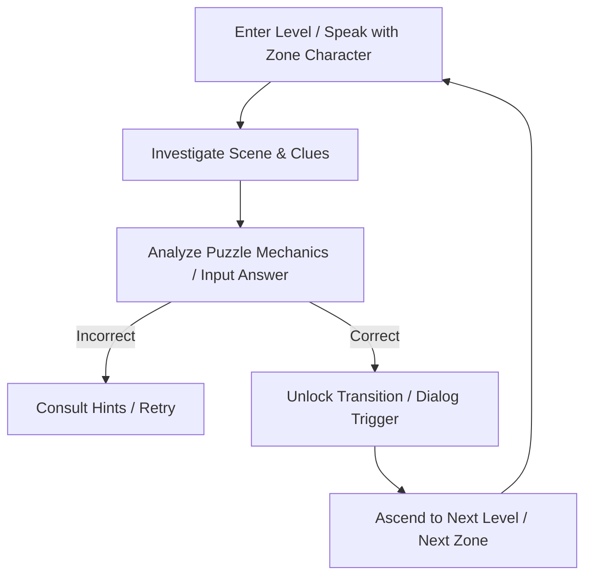

# 🗂️ Game Design Document: Puzzle Escape

## 1. Executive Summary
- **Game Title:** Puzzle Escape
- **Genre:** Narrative-Driven Room Escape / Logic Puzzle Game
- **Target Platforms:** Web (HTML5/Next.js) & Desktop (Electron App wrapping Next.js)
- **Target Audience:** Puzzle enthusiasts who enjoy logic grids, interactive mechanics, ciphers, math, and dark atmospheric narrative.

## 2. Core Game Vision & Pillars
- **Atmospheric Isolation:** A mysterious and dark narrative progression from a cold prison cell to the depths of Hell.
- **Intellectual Variety:** Challenging logic, math, patterns, and interactive spatial puzzles that demand critical thinking rather than quick reflexes.
- **Narrative Characters:** Rich, voiceful mentors/guards who guide or mock the player's progress across distinct thematic zones.

## 3. The Core Loop

## 4. Progression & Thematic Zones
The game spans 5 distinct zones, each managed by a unique character with 10 challenging levels:
1. **Zone 1: Prison Cell (Levels 1–10)** - Overseen by the *Skeleton Guard*. Morbid, rustic, bone-clacking prison aesthetics.
2. **Zone 2: Mansion (Levels 11–20)** - Overseen by the *Butler*. Elegant, classical, intellectual, and British-formal.
3. **Zone 3: Forest (Levels 21–30)** - Overseen by the *Gypsy Teller*. Mystical, celestial, Romani folklore, and tarot-infused.
4. **Zone 4: Desert (Levels 31–40)** - Overseen by the *Sphinx*. Hieroglyphics, history, relics, and ancient Egyptian mathematics.
5. **Zone 5: Hell (Levels 41–50)** - Overseen by *The Devil*. Moral irony, infernal machinery, damnation, and final judgment.

## 5. UI/UX Style Requirements
- **Theme:** Ultra-premium dark mode with rich glassmorphism elements.
- **Color Palette:** harmonious gradients tailored to each zone:
  - Prison: Muted slate blues, bone greys, and pale torch orange.
  - Mansion: Royal mahogany, velvet purple, and gold highlights.
  - Forest: Midnight teal, emerald, and starlight white/gold.
  - Desert: Warm sand, amber gold, and deep lapis lazuli.
  - Hell: Obsidian black, blood crimson, and flickering brimstone yellow.
- **Typography:** Modern, legible sans-serif headings combined with thematic serifs for narrative blocks (e.g., Google Fonts like Inter or Outfit).

## 6. Technical Architecture
- **Framework:** Next.js 14 (App Router) + React 18 + TypeScript.
- **Layouts & Animations:** Tailwind CSS for layout structure, Framer Motion for smooth transitions, slide-ins, and dialogue animations.
- **Desktop Distribution:** Electron wrapper packaging the Next.js production build (`electron/main.ts`).
- **Save State Persistence:** Local state stored in `localStorage` on web and synchronizing to the file system on Desktop.
